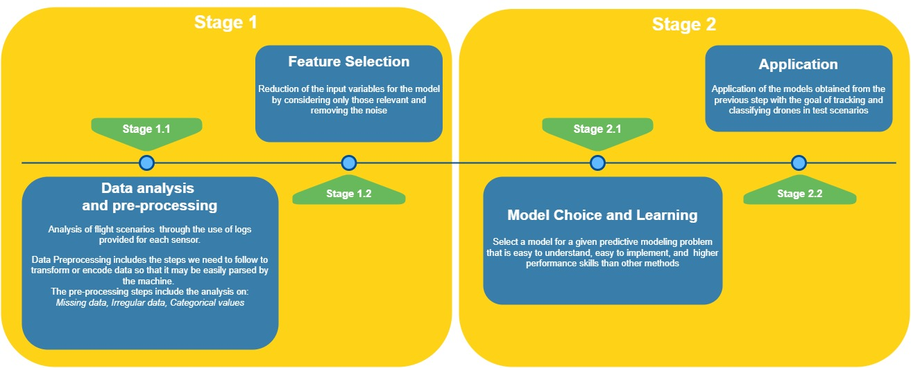
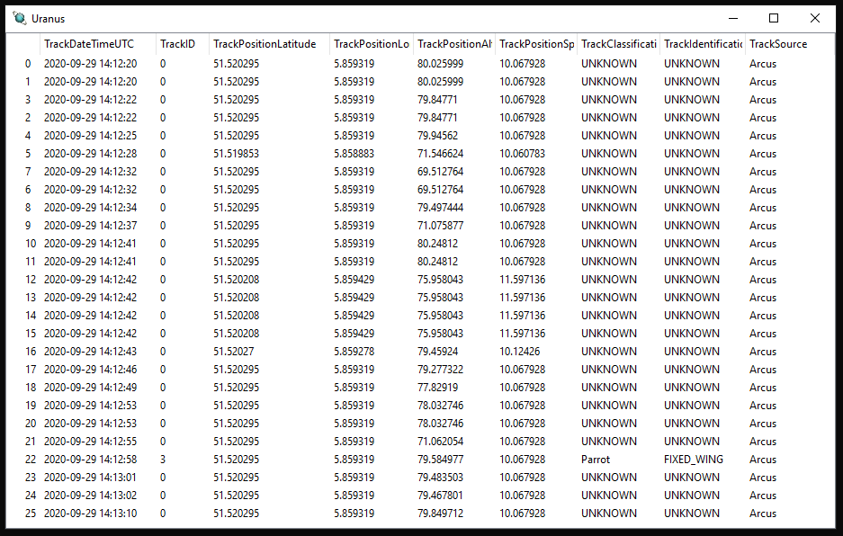
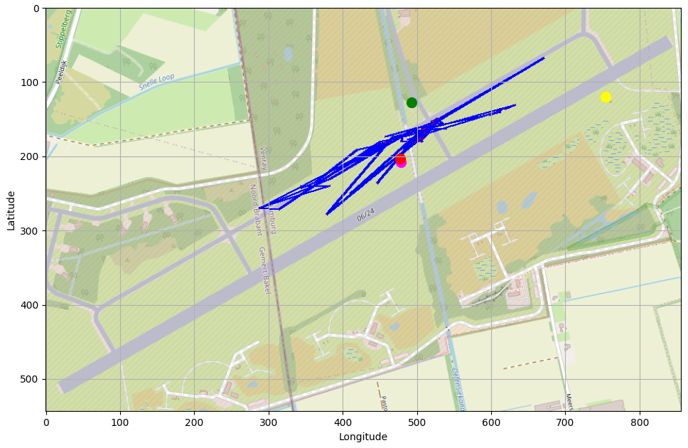
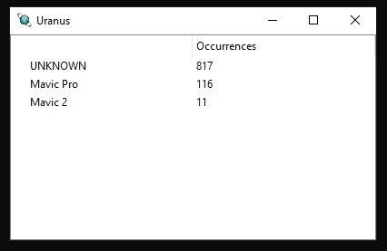
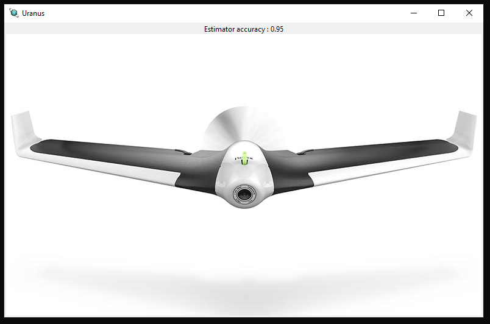

[](https://www.apache.org/licenses/)

# URANUS: Design and Implementation of a Radio Frequency Tracking, Classification and Identification Machine Learning System of Unmanned Aircraft Vehicles

This repository contains an open source implementation of the NATO-published challenge solution related 
to UAS drone detection and tracking available at the link https://www.kaggle.com/c/icmcis-drone-tracking/overview
The task we set with this project is to detect, track, and identify Class 1 UAS within a protected area, 
taking advantage of detections made by various sensors. Drones will be tracked with respect 
to position, speed, and altitude. The observations, in the case of drone detection, will then be classified by drone type 
(fixed or rotating wings) and the name of the potential detected UAS will be indicated 
(e.g. DJI Mavic Pro).



# Prerequisites


This repository assumes Python 3.8.3 or newer is used.

> Project dependencies


| Library  | README |
| ------ | ------ |
| imblearn | https://imbalanced-learn.org/stable/ |
| scikit-learn 1.0.2| https://scikit-learn.org/ |
| NumPy 1.22.3| https://numpy.org/ |
| Pandas 1.4.2 | https://pandas.pydata.org/ |
| pickle 4.0 | https://docs.python.org/3/library/pickle.html|
| Matplotlib | https://matplotlib.org/ |
| Scipy 1.8.0|https://scipy.org/|


## Istructions

Run the following command to get the project
```js
git clone https://github.com/RedEyes94/Uranus.git
```

Open command prompt, and go to project path

```js
cd /path/to/Uranus
```
Run the following commands
```js
$ py console.py
```
After the script execution a menu will be shown. In this menu you can choose one of the available scenarios

```js
*************************************************
*****************  Uranus  **********************
*************************************************

 All available test scenarios

1 )  1a : only one drone in flight
2 )  1b : only one drone in flight
3 )  2a : two drones flying
4 )  2b : two drones flying
5 )  2c : two drones flying
6 )  2d : two drones flying
7 )  3a : only one drone in flight (Parrot)
```
After the scenario has been selected, the time intervals of the flight will be displayed. Enter the values within the range.

```js
*************************************************
*****************  URANUS  **********************
*************************************************

 All available test scenarios

1 )  1a : only one drone in flight
2 )  1b : only one drone in flight
3 )  2a : two drones flying
4 )  2b : two drones flying
5 )  2c : two drones flying
6 )  2d : two drones flying
7 )  3a : only one drone in flight (Parrot)

Choose test scenario:1a
Choose range datatime into : 2020-09-29 13:00:09 and 2020-09-29 13:09:16
Insert first range value:  2020-09-29 13:04:09
Insert second range value:  2020-09-29 13:09:16
```
After setting the date range, the software will display in order: the list of detections in the indicated range, the projection of latitudes and longitudes on a map showing the flight path of the drone and finally it will display an image containing the drone(s) detected in the specified range.






## Repository Structure

```js
├── 1-DataCleaned                        # Contains the files obtained from the data cleaning phase
├── 2-AlviraClustering                   # Contains the files obtained from the data clustering phase on Alvira
├── 3-ArcusClustering                    # Contains the files obtained from the data clustering phase on Arcus
├── 4-DataMerged                         # Contains the files obtained from the data merge of all sensors and drone
├── ModelliEstratti                      # Contains the models obtained from training phase
├── Scensori                             # Contains the classes for Alvira, Arcus, Diana, Venus e Drone
├── Steps                                # Contains the classes for Alvira, Arcus, Diana, Venus e Drone
│   ├── Step_0                           # Contains py files for Outliers detection, Data analisys and Clean
│   ├── Step_1                           # Contains py files for clustering 
│   │   ├── AlviraMapsClustering         # Contains csv and png files related to clustering results  
│   ├── Step_2                           # Contains py files for merge all sensors files
│   ├── Step_3                           # Contains py files for anova analisys, creation of learning models  
│   ├── Step_4                           # Contains py files a for testing models generated in Step 3  
│   │   ├── Latitude_Longitude_predette  # Contains csv and png files related to predict results
├── SubmissionFileTestResults            # Contains csv files genereted after prediction in Step 4  
├── Utility                              # Contains py files with some useful functions (e.g. GPS)
```
## Authors
<ul>
<li>Giuseppe De Marzo</li>
(Indipendent Researcher Politecnico di Bari, Bari (Italy), gdemarzo94 at gmail dot com)
<li>Domenico Lofù</li>
(Dept. of Electrical and Information Engineering (DEI), Politecnico di Bari, Bari (Italy), domenico dot lofu at poliba dot it\br>
and Innovation, Marketing & Technology, Exprivia S.p.A., Molfetta (Italy), domenico dot lofu at exprivia dot com)
<li>Pietro Tedeschi</li>
(Ph.D, Senior Security Researcher @ Technology Innovation Institute, Secure Systems Research Center, Abu Dhabi, pietro dot tedeschi at tii dot ae)
</ul>

## License
The code is provided under the Apache License. If you need it under a more permissive 
license then please contact me.
